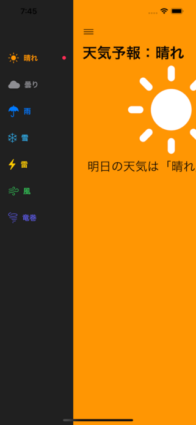
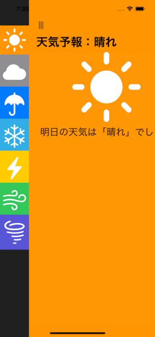

# SideMenuKitSwiftUI

SideMenuKitSwiftUI is a framework for displaying menus on the left side of the screen. Two types of menu styles are provided: sliding menu and sidebar menu. A sliding menu is a menu with a title and an icon. Sidebar menu is a menu with only icons.





You can add this package on Xcode.
See [documentation](https://developer.apple.com/documentation/swift_packages/adding_package_dependencies_to_your_app).


## How to Use

You can just import SideMenuKitSwiftUI to use the package.

```swift
import SwiftUI
import SideMenuKitSwiftUI

struct ContentView: View
{
  enum Menu: Int, Hashable
  {
    case fine
    case cloudy
    case rainy
    case snow
    case bolt
    case wind
    case tornado
  }

  private let items: [SMKSideMenuItem<Menu>] = [
    (title: "Fine",    icon: "sun.max.fill",  tag: Menu.fine,    color: Color.orange),
    (title: "Cloudy",  icon: "cloud.fill",    tag: Menu.cloudy,  color: Color.gray),
    (title: "Rainy",   icon: "umbrella.fill", tag: Menu.rainy,   color: Color.blue),
    (title: "Snow",    icon: "snowflake",     tag: Menu.snow,    color: Color.cyan),
    (title: "Bolt",    icon: "bolt.fill",     tag: Menu.bolt,    color: Color.yellow),
    (title: "Wind",    icon: "wind",          tag: Menu.wind,    color: Color.green),
    (title: "Tornado", icon: "tornado",       tag: Menu.tornado, color: Color.indigo)
  ].map({ SMKSideMenuItem<Menu>(title: $0.title, icon: $0.icon, tag: $0.tag, color: $0.color) })

  private let configuration: SMKSideMenuConfiguration = .slide

  @State private var path: NavigationPath = .init()

  var body: some View {
    SMKSideMenu<Menu,MenuContentView>(navigationPath: $path, configuration: configuration, menuItems: items, startItem: .fine) {
      (menu) -> MenuContentView in
      MenuContentView(selected: menu, items: items)
    }
  }

  struct MenuContentView: View
  {
    private let menu: Menu
    private let item: SMKSideMenuItem<Menu>

    init(selected menu: Menu, items: [SMKSideMenuItem<Menu>]) {
      self.menu = menu
      self.item = items.filter({ $0.tag == menu })[0]
    }

    @ViewBuilder
    var body: some View {
      VStack {
        item.icon.resizable()
          .aspectRatio(contentMode: .fit)
          .foregroundColor(.white)
          .frame(width: 192, height: 192)
        Spacer()
      }
      .navigationDestination(for: String.self) { value in
        Text(value) // can handle NavigationLink programmatically
      }
      .navigationTitle("\(item.title)")
      .frame(maxWidth: .infinity, alignment: .center)
      .background(item.color)
    }
  }
}
```

The side menu style can be easily switched by simply changing the __configuration__ value from __.slide__ to __.sidebar__.


```swift
  private let configuration: SMKSideMenuConfiguration = .slide
```

```swift
  private let configuration: SMKSideMenuConfiguration = .sidebar
```

## SMKSideMenuConfiguration Reference

Below you can see all the properties that you can set in the configuration.

| Property          | Type            | Description                                          |
| ----------------- | --------------- | ---------------------------------------------------- |
| `menuStyle`       | `MenuStyle`     | Menu-style (`slide` or `sidebar`) |
| `sidebarWidth`    | `CGFloat`       | Width of the left area |
| `selectedStyle`   | `SelectedStyle` | Selected-style on the `slide` (`none`, `pinpoint`, `highlight`, `underline`) |
| `selectedColor`   | `Color`         | Color at menu selected on the `slide` |
| `backgroundColor` | `Color`         | Background color of the left area |


## SMKSideMenu Initializers

```swift
  SMKSideMenu(configuration: SMKSideMenuConfiguration, menuItems: [SMKSideMenuItem<Menu>], startItem: Menu, @ViewBuilder content: @escaping (Menu) -> Content) -> View where Menu: Hashable, Content: View
```

On iOS 16 and later, the initializer supports NavigationPath for NavigationStack.

```swift
  SMKSideMenu(navigationPath: Binding<NavigationPath>, configuration: SMKSideMenuConfiguration, menuItems: [SMKSideMenuItem<Menu>], startItem: Menu, @ViewBuilder content: @escaping (Menu) -> Content) -> View where Menu: Hashable, Content: View
```

## Requirements

 - Swift 5 or later
 - iOS 15 or later
 - Xcode 13.4 or later

## License

This package is licensed under [BSD License](LICENSE)
